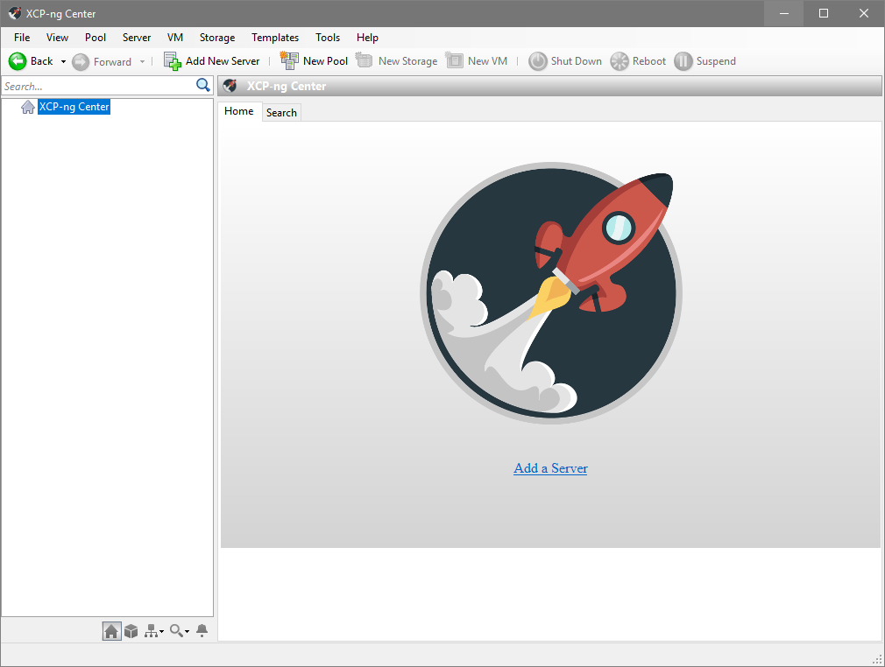

XCP-ng Center
=============

This repository contains the source code for XCP-ng Center.

XCP-ng Center is a Windows-based management tool for XCP-ng and Citrix® XenServer® environments
which enables users to manage and monitor XCP-ng and Citrix® XenServer® hosts and resource pools,
and to deploy, monitor, manage and migrate virtual machines.

XCP-ng Center is written mostly in C#.

Contributions
-------------

The preferable way to contribute patches is to fork the repository on Github and
then submit a pull request. Also have a look at https://xcp-ng.org/forum.

License
-------

This code is licensed under the BSD 2-Clause license. Please see the
[LICENSE](LICENSE) file for more information.

Developer Build
---------------

Latest instructions can be found at https://github.com/xcp-ng/xenadmin/wiki/Building
