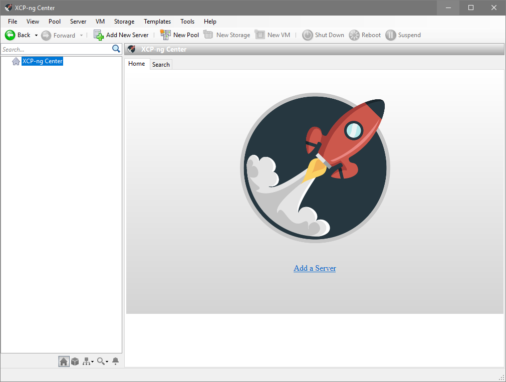

## Notice

XCP-ng Center is no longer EOL! We have a new maintainer (Michael Manley) to work on the current codebase and will maintain it for the foreseeable future.

Please submit any bug reports to the issue tracker, and expect for GitHub Actions to be enabled soon for CI/CD for commmited builds.

See here for discussion: https://xcp-ng.org/forum/topic/8202/eol-xcp-ng-center-has-come-to-an-end

## Disclaimer
The official graphical client for XCP-ng is [Xen Orchestra](https://xen-orchestra.com), which gets support from a team of several developers.
XCP-ng Center is maintained by community members on their free time and hosted by the XCP-ng project.

XCP-ng Center
=============

This repository contains the source code for XCP-ng Center.

This specific branch will be for the Avalonia UI Rewrite, If you are wanting the more stable and Windows-only WinForms version, see the 
development branch.

XCP-ng Center is a Windows-based management tool for XCP-ng and Citrix® XenServer® environments
which enables users to manage and monitor XCP-ng and Citrix® XenServer® hosts and resource pools,
and to deploy, monitor, manage and migrate virtual machines.

XCP-ng Center is written mostly in C#.

Contributions
-------------

The preferable way to contribute patches is to fork the repository on Github and
then submit a pull request. Also have a look at https://xcp-ng.org/forum.

License
-------

This code is licensed under the BSD 2-Clause license. Please see the
[LICENSE](LICENSE) file for more information.

Developer Build
---------------

Latest instructions can be found at https://github.com/xcp-ng/xenadmin/wiki/Building
